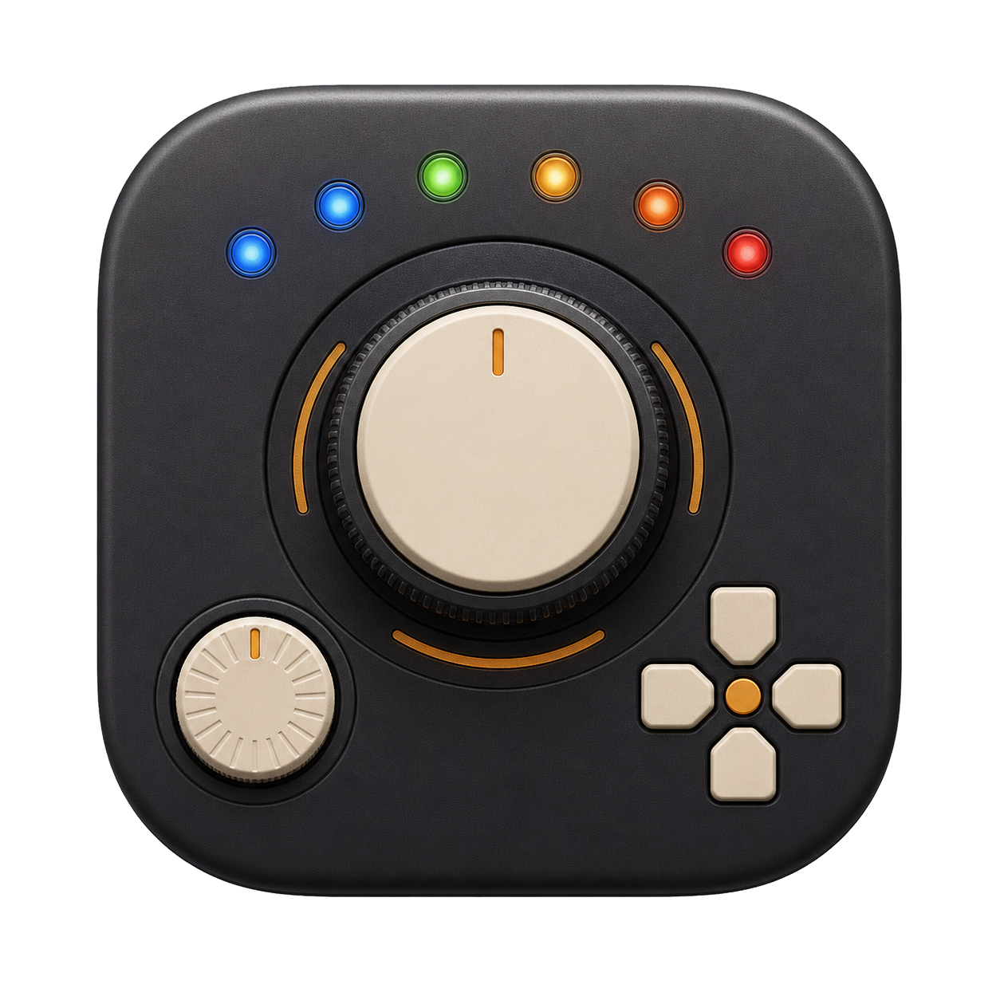
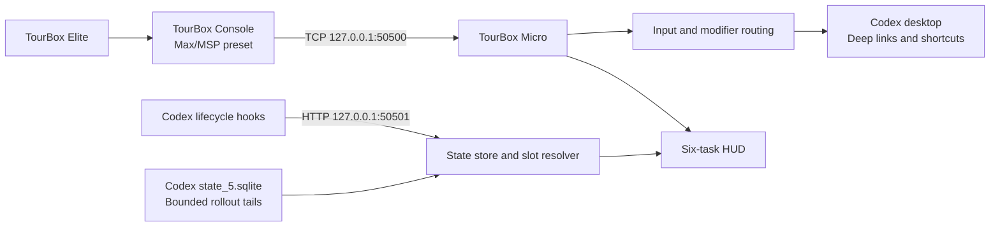

<p align="center">
  
</p>

<h1 align="center">TourBox Micro</h1>

<p align="center">
  Turn a TourBox Elite into a tactile control surface for Codex on macOS.
</p>

<p align="center">
  <strong>English</strong> · <a href="README.zh-CN.md">简体中文</a>
</p>

<p align="center">
  <a href="https://github.com/MJYKIM99/tourbox-micro/actions/workflows/ci.yml"></a>
  
  
  <a href="LICENSE"></a>
  
</p>

TourBox Micro is a native macOS bridge between TourBox Console's Max/MSP
events and the Codex desktop app. It combines tactile shortcuts, six stable
task slots, a live glass-light HUD, push-to-talk, Codex deep links, and local
lifecycle persistence in one small menu-bar app.

> [!IMPORTANT]
> TourBox Micro is an independent public beta. It is not affiliated with or
> endorsed by TourBox Tech or OpenAI. Version **0.7.2 (Build 15)** is tested
> with TourBox Elite, TourBox Console 5.2.6, and macOS 14 or later.

## Highlights

| Capability | What it provides |
|---|---|
| Six stable task slots | Priority, recent, or pinned ordering without lights constantly jumping between tasks |
| Native HUD | A compact six-light glass HUD or a detailed list; hover for context and click to open the task |
| Direct task navigation | Open the exact Codex task through `codex://threads/<id>` from hardware or HUD |
| Tactile Codex controls | Approve, reject, search, model picker, independent chat, review panel, and more |
| Frontmost-app actions | Copy, paste, and screenshot stay in the app you are currently using |
| True push-to-talk | Short press starts voice input and release stops it using real press/release events |
| Local state recovery | SQLite persistence plus bounded rollout-tail recovery after relaunch |
| Native settings and diagnostics | Configure mappings, HUD behavior, launch at login, permissions, and integrations |

## How it works



Both runtime listeners bind to loopback only. TourBox Micro does not expose a
LAN or internet-facing control service.

## Requirements

- macOS 14 or later
- TourBox Elite
- TourBox Console 5.2.6 or a compatible release
- ChatGPT for macOS with Codex available
- Xcode or a Swift 6 toolchain for source builds
- Accessibility permission for synthesized keyboard and scroll events

Other TourBox models and Console releases may work, but are not yet part of the
tested compatibility matrix.

## Quick start

### 1. Clone and test

```sh
git clone https://github.com/MJYKIM99/tourbox-micro.git
cd tourbox-micro
swift test
```

### 2. Build and install

```sh
./Scripts/build-app.sh --install
open "/Applications/TourBox Micro.app"
```

The build script preserves the Apple Development identity of an existing
`/Applications/TourBox Micro.app`; on first install it selects the first
available development identity. Override it when needed:

```sh
TOURBOX_SIGNING_IDENTITY="Apple Development: Your Name (TEAMID)" \
  ./Scripts/build-app.sh --install
```

If no development identity is available, the script uses an ad-hoc signature.
That is suitable for evaluation, but macOS may request Accessibility permission
again after a rebuild. Use a stable identity for daily use. You can request
ad-hoc signing explicitly with `TOURBOX_SIGNING_IDENTITY="-"`.

### 3. Install the Codex integration

Open **Settings → Overview → Reinstall Codex Integration**, or run:

```sh
"/Applications/TourBox Micro.app/Contents/MacOS/TourBoxMicro" --install
```

The installer merges its entries into `~/.codex/hooks.json` and
`~/.codex/keybindings.json`. It creates timestamped backups before changing
either file and leaves unrelated entries intact.

### 4. Generate and import the TourBox preset

Import TourBox Console's Max/MSP template once so Console can adapt it to the
connected device. Then generate the C1/C2-corrected preset from that adapted
source:

```sh
python3 Scripts/generate-tourbox-preset.py \
  --source "/path/to/your/device-adapted-Max-MSP-preset" \
  --name "Codex Micro Advanced" \
  "dist/Codex Micro Advanced.tb"
```

Import the generated `.tb` file and associate it with the ChatGPT app. The
generator reads the source preset and writes a new file; it does not modify the
source preset or TourBox Console's database. See
[the preset guide](Docs/TOURBOX_PRESET.md) for the full setup.

## Default controls

### Base layer

| TourBox control | Default action |
|---|---|
| Knob rotate | Decrease / increase reasoning effort (`F17` / `F16`; record once in Codex) |
| Knob press | Open model picker |
| Scroll wheel | Scroll the current conversation |
| Scroll press | Jump to the latest message |
| Dial rotate | Previous / next assigned task |
| Dial press | Search all chats |
| Top | New independent chat |
| Tall | Approve or send |
| Side | Reject or cancel |
| Short hold | Push-to-talk; release stops voice input |
| C1 / C2 | Copy / paste in the frontmost app |
| Up | Screenshot utility (`⇧⌘2`) |
| Right / Left | Next / previous recently viewed chat |
| Down | Toggle review panel |
| Tour tap | Show or hide the HUD |

### Tour modifier layer

| Combination | Action |
|---|---|
| Tour + Knob press | Quick chat |
| Tour + Scroll press | Find in current chat |
| Tour + Dial press | Open command menu |
| Tour + Top | Search project files |
| Tour + C1 / C2 / Up / Right / Down / Left | Open task slots 1–6 |

Every press action except the fixed Short and Tour behaviors can be changed in
**Settings → Control Mapping** without regenerating the TourBox preset.

## HUD and task slots

Choose between two HUD styles in Settings:

- **Glass lights** — six compact status lights near the lower-left corner.
- **Detailed list** — six task rows near the upper-right corner.

| Color | State | Motion |
|---|---|---|
| Gray | Unassigned or inactive | Still |
| White | Assigned and idle | Still |
| Blue | Codex is running | Directional shimmer inside the rounded light core |
| Green | Completed | One rounded status-transition burst |
| Amber | Waiting for confirmation or input | Slow breathing |
| Red | Error | One restrained shake on transition |

Hover a light to see the task title, project folder, state, and latest visible
assistant update. Click the light or hover card to open that task in Codex.
Animations respect macOS Reduce Motion and can also be disabled in Settings.

Slot ordering is deterministic:

- **Priority** puts input requests, errors, unread completions, and running work first.
- **Recent** follows Codex recency while preserving a stable assignment when possible.
- **Pinned** favors pinned Codex tasks before filling remaining slots by recency.

## Local data and privacy

TourBox Micro stores lifecycle metadata in:

```text
~/Library/Application Support/TourBox Micro/status.sqlite3
```

The database contains task IDs, working directories, lifecycle states,
timestamps, and completion acknowledgement. The latest visible progress is
read from a bounded rollout-file tail and kept in memory; complete prompts,
responses, reasoning content, clipboard data, and TourBox input are not stored
by TourBox Micro or uploaded anywhere.

Read [PRIVACY.md](PRIVACY.md) for the complete data boundary and
[SECURITY.md](SECURITY.md) for vulnerability reporting.

## Diagnostics

Open Settings from the menu-bar dial icon or press `⌘,`. The Diagnostics page
checks the TourBox connection, loopback listeners, Codex database, hooks,
keybindings, Accessibility permission, local state database, and login item.

The same checks are available from Terminal without changing configuration:

```sh
"/Applications/TourBox Micro.app/Contents/MacOS/TourBoxMicro" --doctor
```

## Development

```sh
# Debug build and all tests
swift test

# Release app bundle without installing
./Scripts/build-app.sh

# Release build, sign, verify, and install
./Scripts/build-app.sh --install

# Open Settings directly
open "/Applications/TourBox Micro.app" --args --settings
```

The test suite covers protocol decoding, modifier routing, configurable
mappings, configuration merging, persistence, rollout recovery, display-text
cleanup, slot ordering, and status-transition feedback.

```text
tourbox-micro/
├── Docs/                       TourBox preset and hardware mapping docs
├── Resources/                  Info.plist and app icon
├── Scripts/                    Build, preset generation, and diagnostics
├── Sources/
│   ├── TourBoxCore/            Protocol, routing, state, slots, configuration
│   └── TourBoxMicro/           AppKit/SwiftUI app, HUD, settings, local servers
├── Tests/TourBoxCoreTests/     Swift Testing suite
├── Package.swift
└── THIRD_PARTY_NOTICES.md
```

## Troubleshooting

<details>
<summary>TourBox Console does not connect</summary>

Confirm TourBox Micro is running. In TourBox Console, switch to another preset
and back to the Codex preset. Diagnostics should report that
`127.0.0.1:50500` is listening.

</details>

<details>
<summary>Rotating the knob does not change reasoning effort</summary>

In Codex **Settings → Keyboard Shortcuts**, record “increase reasoning effort”
and “decrease reasoning effort.” Rotate the knob one step right for `F16` and
one step left for `F17` while each recorder is active.

</details>

<details>
<summary>Accessibility permission keeps disappearing</summary>

Use one consistently signed copy at `/Applications/TourBox Micro.app`. Avoid
running duplicate builds with the same bundle identifier. Ad-hoc builds are
useful for evaluation but are not recommended for permanent input permission.

</details>

<details>
<summary>The HUD has state, but hardware input does nothing</summary>

HUD state and TourBox input are independent paths. Check the TourBox TCP
connection and Accessibility permission separately in Diagnostics.

</details>

## Contributing

Contributions for additional TourBox models, Console versions, Codex changes,
accessibility, tests, and documentation are welcome. Start with
[CONTRIBUTING.md](CONTRIBUTING.md). Please keep personal Codex databases,
rollouts, exported configuration, signing files, and device logs out of issues
and commits. User-facing changes are tracked in [CHANGELOG.md](CHANGELOG.md).

## Third-party software

Runtime dependencies and their licenses are recorded in
[THIRD_PARTY_NOTICES.md](THIRD_PARTY_NOTICES.md). TourBox Micro's implementation
is independent; no source code from the interoperability projects reviewed
during research is included here.

## License

TourBox Micro is available under the [MIT License](LICENSE).
