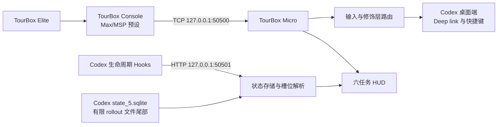

<p align="center">
  
</p>

<h1 align="center">TourBox Micro</h1>

<p align="center">
  把 TourBox Elite 变成 Codex 在 macOS 上的实体控制台。
</p>

<p align="center">
  <a href="README.md">English</a> · <strong>简体中文</strong>
</p>

<p align="center">
  <a href="https://github.com/MJYKIM99/tourbox-micro/actions/workflows/ci.yml"></a>
  <a href="https://github.com/MJYKIM99/tourbox-micro/releases/latest"></a>
  
  
  <a href="LICENSE"></a>
  
</p>

TourBox Micro 是一个原生 macOS 桥接应用，把 TourBox Console 的 Max/MSP
事件转换为 Codex 桌面端操作。它在一个轻量菜单栏 App 中提供实体快捷操作、
六个稳定任务槽位、实时玻璃灯 HUD、按住说话、Codex deep link 和本地状态恢复。

> [!IMPORTANT]
> TourBox Micro 是独立开发的公开测试版，与 TourBox Tech 或 OpenAI 没有关联，
> 也未获得其官方背书。版本 **0.8.1（Build 17）** 已在 TourBox Elite、
> TourBox Console 5.2.6 和 macOS 14 或更高版本上测试。

<p align="center">
  
</p>

<p align="center"><sub>独立状态色玻璃灯：没有包围整排灯的背景底板，也没有持续空转的装饰动画。</sub></p>

## 核心能力

| 能力 | 说明 |
|---|---|
| 六个稳定任务槽位 | 支持优先级、最近使用或置顶排序，避免任务灯频繁跳位 |
| 原生 HUD | 紧凑的六灯玻璃阵列或详细列表；悬停查看上下文，点击打开任务 |
| 任务直达 | 从硬件或 HUD 通过 `codex://threads/<id>` 打开准确的 Codex 任务 |
| Codex 实体控制 | 审批、拒绝、搜索、模型选择、独立聊天、审阅面板等 |
| 前台应用操作 | 复制、粘贴和截图留在当前使用的 App，不强制切换到 Codex |
| 真正的按住说话 | Short 按下开始、松开停止，保留真实 press/release 语义 |
| 本地状态恢复 | SQLite 持久化，并在重启后从 rollout 文件的有限尾部恢复状态 |
| 原生设置与诊断 | 配置按键、HUD、登录启动、权限和 Codex 集成 |
| 能耗友好的运行时 | 原生 SQLite、有限后台对账、去重渲染，并在窗口隐藏时停止 UI 工作 |

## 工作原理



两个运行时服务都只绑定在本机回环地址。TourBox Micro 不会开放局域网或互联网
远程控制服务。

## 环境要求

- macOS 14 或更高版本
- TourBox Elite
- TourBox Console 5.2.6 或兼容版本
- 已启用 Codex 的 ChatGPT macOS 桌面端
- 用于源码构建的 Xcode 或 Swift 6 工具链
- 用于发送键盘与滚动事件的 macOS 辅助功能权限

其他 TourBox 型号和 Console 版本可能可以工作，但尚未进入正式测试矩阵。

## 快速开始

### 1. 克隆并测试

```sh
git clone https://github.com/MJYKIM99/tourbox-micro.git
cd tourbox-micro
swift test
```

### 2. 构建并安装

```sh
./Scripts/build-app.sh --install
open "/Applications/TourBox Micro.app"
```

如果 `/Applications/TourBox Micro.app` 已存在，构建脚本会沿用它的 Apple
Development 签名身份；首次安装则选择第一个可用的开发身份。需要时可以覆盖：

```sh
TOURBOX_SIGNING_IDENTITY="Apple Development: Your Name (TEAMID)" \
  ./Scripts/build-app.sh --install
```

如果没有开发签名，脚本会使用 ad-hoc 签名。这适合试用，但重新构建后 macOS
可能要求再次授予辅助功能权限。日常使用建议采用稳定签名。也可以通过
`TOURBOX_SIGNING_IDENTITY="-"` 明确要求 ad-hoc 签名。

### 3. 安装 Codex 集成

打开 **设置 → 总览 → 重新安装 Codex 集成**，或者执行：

```sh
"/Applications/TourBox Micro.app/Contents/MacOS/TourBoxMicro" --install
```

安装器会把自己的配置合并到 `~/.codex/hooks.json` 与
`~/.codex/keybindings.json`。修改前会创建带时间戳的备份，并保留所有无关配置。

### 4. 生成并导入 TourBox 预设

先导入一次 TourBox Console 的 Max/MSP 模板，让 Console 根据已连接设备完成适配。
然后从适配后的源预设生成修复了 C1/C2 的版本：

```sh
python3 Scripts/generate-tourbox-preset.py \
  --source "/path/to/your/device-adapted-Max-MSP-preset" \
  --name "Codex Micro Advanced" \
  "dist/Codex Micro Advanced.tb"
```

导入生成的 `.tb` 文件，并把它关联到 ChatGPT App。生成器只读取源预设并写入
一个新文件，不会修改源预设或 TourBox Console 数据库。完整设置流程见
[预设文档](Docs/TOURBOX_PRESET.md)。

## 默认硬件映射

### 基础层

| TourBox 控件 | 默认动作 |
|---|---|
| 旋钮旋转 | 降低 / 提高推理强度（`F17` / `F16`，需在 Codex 中录制一次） |
| 旋钮按下 | 打开模型选择器 |
| 滚轮 | 滚动当前对话 |
| 滚轮按下 | 跳到最新消息 |
| 转盘旋转 | 上一个 / 下一个已分配任务 |
| 转盘按下 | 搜索所有聊天 |
| Top | 新建独立聊天 |
| Tall | 批准或发送 |
| Side | 拒绝或取消 |
| Short 按住 | 按住说话，松开停止语音输入 |
| C1 / C2 | 在当前前台 App 中复制 / 粘贴 |
| 上 | 截图工具（`⇧⌘2`） |
| 右 / 左 | 下一个 / 上一个最近查看的聊天 |
| 下 | 切换审阅面板 |
| Tour 单击 | 显示或隐藏 HUD |

### Tour 修饰层

| 组合 | 动作 |
|---|---|
| Tour + 旋钮按下 | 快速聊天 |
| Tour + 滚轮按下 | 在当前聊天中查找 |
| Tour + 转盘按下 | 打开命令菜单 |
| Tour + Top | 搜索项目文件 |
| Tour + C1 / C2 / 上 / 右 / 下 / 左 | 打开任务槽位 1–6 |

除 Short 和 Tour 的固定行为外，所有按下动作都可以在
**设置 → 控制映射** 中修改，不需要重新生成 TourBox 预设。

## HUD 与任务槽位

可以在设置中选择两种 HUD：

- **玻璃灯阵**：位于左下角附近的六盏紧凑状态灯。
- **详细列表**：位于右上角附近的六行任务状态。

| 颜色 | 状态 | 动效 |
|---|---|---|
| 灰色 | 未分配或未激活 | 静止 |
| 白色 | 已分配、空闲 | 静止 |
| 蓝色 | Codex 正在运行 | 静态状态光 |
| 绿色 | 已完成 | 状态切换时触发一次圆角扩散 |
| 琥珀色 | 等待确认或输入 | 静态注意色 |
| 红色 | 任务错误 | 状态切换时触发一次克制的抖动 |

悬停在灯上可以查看任务标题、项目文件夹、当前状态和最近一条可见 assistant
进展。点击灯或悬浮卡片会在 Codex 中打开对应任务。动画遵循 macOS
“减少动态效果”设置，也可以在应用设置中关闭；无论是否开启动画，状态色都会保留。

槽位排序是确定性的：

- **优先级**：需要输入、错误、未读完成和运行中任务优先。
- **最近使用**：按照 Codex 的最近使用时间排序，并尽量保持原槽位。
- **置顶**：优先放置 Codex 中置顶的任务，其余槽位按最近使用时间填充。

## 性能

v0.8.0 把周期性的 Codex 数据库查询和 rollout 读取移出主线程，合并重叠刷新，
跳过内容没有变化的 HUD 渲染，并在窗口隐藏后释放整棵窗口与 SwiftUI 视图树。
六盏灯共享一个带独立灯形遮罩的原生玻璃层，以静态状态光替代逐灯持续扫光和呼吸。

在 Apple M5 Pro MacBook Pro 上进行现场诊断时，保持六灯 HUD 可见并运行多个任务，
连续 15 次、每秒一次的进程采样平均为 **1.21% App CPU**；调查期间持续动画版本
的平均值在 **6.08%–14.64%**。这是特定工作负载下的诊断结果，不是跨设备通用
跑分；任务组合、显示器刷新率、macOS 和硬件都会影响结果。实现与测量说明见
[Docs/PERFORMANCE.md](Docs/PERFORMANCE.md)。

## 本地数据与隐私

TourBox Micro 把生命周期元数据存储在：

```text
~/Library/Application Support/TourBox Micro/status.sqlite3
```

数据库只包含任务 ID、工作目录、生命周期状态、时间戳和完成确认状态。最近一条
可见进展从 rollout 文件的有限尾部读取并保存在内存中；TourBox Micro 不会保存
完整 prompt、回复、推理内容、剪贴板数据或 TourBox 输入，也不会上传这些数据。

完整数据边界见 [PRIVACY.md](PRIVACY.md)，漏洞报告方式见
[SECURITY.md](SECURITY.md)。

## 设置与诊断

点击菜单栏中的旋钮图标，或按 `⌘,` 打开设置。诊断页面会检查 TourBox 连接、
本机服务、Codex 数据库、Hooks、快捷键、辅助功能权限、状态数据库和登录启动项。

也可以从命令行运行不会修改配置的诊断：

```sh
"/Applications/TourBox Micro.app/Contents/MacOS/TourBoxMicro" --doctor
```

## 开发

```sh
# Debug 构建与全部测试
swift test

# Release 应用包，不安装
./Scripts/build-app.sh

# Release 构建、签名、验证并安装
./Scripts/build-app.sh --install

# 直接打开设置页
open "/Applications/TourBox Micro.app" --args --settings
```

当前 Release 只发布源码，不分发开发签名或未经 Apple 公证的应用包。发布清单与
二进制分发要求见 [Docs/RELEASING.md](Docs/RELEASING.md)。

测试覆盖协议解码、修饰层路由、可配置映射、配置合并、状态持久化、rollout
恢复、显示文本清理、槽位排序和状态变化反馈。

```text
tourbox-micro/
├── Docs/                       TourBox 预设与硬件映射文档
├── Resources/                  Info.plist 与应用图标
├── Scripts/                    构建、预设生成与诊断工具
├── Sources/
│   ├── TourBoxCore/            协议、路由、状态、槽位与配置
│   └── TourBoxMicro/           AppKit/SwiftUI App、HUD、设置与本机服务
├── Tests/TourBoxCoreTests/     Swift Testing 测试
├── Package.swift
└── THIRD_PARTY_NOTICES.md
```

## 常见问题

<details>
<summary>TourBox Console 没有连接</summary>

确认 TourBox Micro 正在运行。在 TourBox Console 中切换到其他预设，再切回
Codex 预设。诊断页应该显示 `127.0.0.1:50500` 正在监听。

</details>

<details>
<summary>旋钮旋转没有改变推理强度</summary>

在 Codex **设置 → 键盘快捷键** 中录制“增加推理强度”和“降低推理强度”。
录制时向右转动一格得到 `F16`，向左转动一格得到 `F17`。

</details>

<details>
<summary>辅助功能权限反复失效</summary>

只运行一份稳定签名且安装在 `/Applications/TourBox Micro.app` 的应用。不要同时
运行多个相同 bundle ID 的构建。Ad-hoc 签名适合试用，不适合作为永久输入授权。

</details>

<details>
<summary>HUD 有任务状态，但硬件没有反应</summary>

HUD 状态与 TourBox 输入是两条独立链路。请在诊断页分别检查 TourBox TCP 连接和
辅助功能权限。

</details>

## 参与贡献

欢迎增加 TourBox 型号、Console 版本、Codex 变化适配、无障碍、测试和文档。
请先阅读 [CONTRIBUTING.md](CONTRIBUTING.md)。不要把个人 Codex 数据库、
rollout、导出配置、签名文件或设备日志放进 Issue 和提交。面向用户的变化记录在
[CHANGELOG.md](CHANGELOG.md)。

## 第三方软件

运行时依赖及其许可证记录在
[THIRD_PARTY_NOTICES.md](THIRD_PARTY_NOTICES.md)。TourBox Micro 是独立实现，
仓库不包含产品研究阶段查看过的互操作项目源码。

## 许可证

TourBox Micro 使用 [MIT License](LICENSE)。
